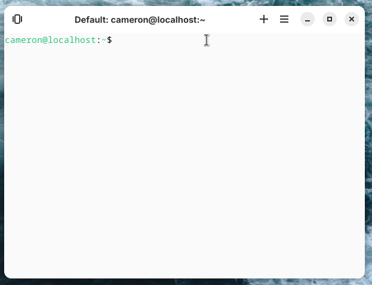

# stillTerminal

A tabbed terminal emulator build for stillOS. Integrates beautilfully with SSH and DistroBox.
stillTerminal icon by [Delphic Melody](https://linksta.cc/@delphic-melody)




## Build instructions:

```bash
$ meson build
$ ninja -C build
$ build/stillTerminal
```

## Dependencies:
```
  dependency('glib-2.0'),
  dependency('gee-0.8'),
  dependency('gobject-2.0'),
  dependency('gtk4'),
  dependency('libadwaita-1'),
  dependency('json-glib-1.0'),
  dependency('vte-2.91-gtk4', version: '>= 0.69.0'),
```
